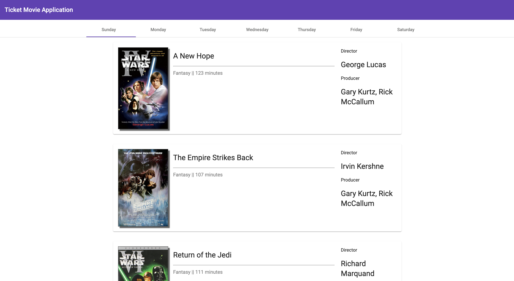

# Cinema

> Don't waste time queuing, choose one of the movies and make a reservation - it's easy!

## Table of Contents

* [General Info](#general-information)
* [Technologies Used](#technologies-used)
* [Screenshots](#screenshots)
* [Setup](#setup)
* [Project Status](#project-status)
* [Room for Improvement](#room-for-improvement)
* [Contact](#contact)

## General Information

This application allows you to view movies in the cinema, make reservations for a given day, time and choose as many seats as you need

## Technologies Used

* This project was generated with [Angular CLI](https://github.com/angular/angular-cli) version 14.0.5.
* Using Angular Material Components

## Screenshots

### Main page of application

### Seat selection

### Summary of reseration

## Setup

Run `npm install` to load all necessary dependencies.
Run `ng serve` for a dev server. Navigate to `http://localhost:4200/`. The app will automatically reload if you change any of the source files.
Run `ng build` to build the project. The build artifacts will be stored in the `dist/` directory. Use the `--prod` flag for a production build.

## Project Status

Project is: _in progress_

## Room for Improvement

Connect to database, finish reservation with sending email to user 

Room for improvement:

* Build own API to connect

To do:

* unit, e2e tests

## Contact

Created by Patryk Król

[Linkedin](https://www.linkedin.com/in/patryk-krol/) or 📧 : patrtyk.krol.98@gmail.com
